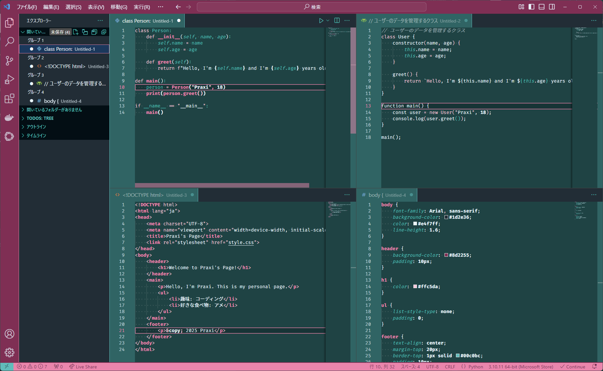

# Praxi Dark Theme

## 概要/ Overview

### JP
「**Praxi Dark**」は、Visual Studio Code用のダークカラーテーマです。
オリジナルキャラクターのPraxiを元に作成しました。

落ち着いた色合いと視認性の高いコントラストが特徴です。

### EN
"**Praxi Dark**" is a dark color theme for Visual Studio Code.
It is based on the original character Praxi.

Featuring a calming color palette and high contrast for better visibility.

## インストール方法 / Installation Instructions

### JP

1. 拡張機能の検索バーに「praxi-dark」と入力
2. インストールボタンをクリック

### EN

1. Enter "praxi-dark" in the extensions search bar
2. Click the install button

## サポート

### JP
もし質問やバグ報告があれば、[本リポジトリ](https://github.com/sleepy-cat-devs/vscode-theme-Praxi-Dark/issues)でお問い合わせください。

### EN
If you have any questions or bug reports, please reach out on [the repository](https://github.com/sleepy-cat-devs/vscode-theme-Praxi-Dark/issues).

**Enjoy coding with Praxi Dark!**